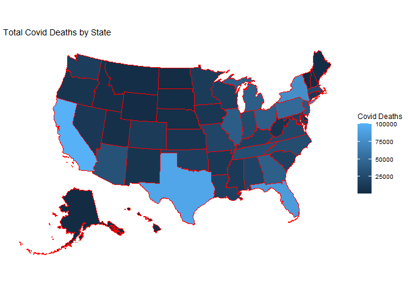
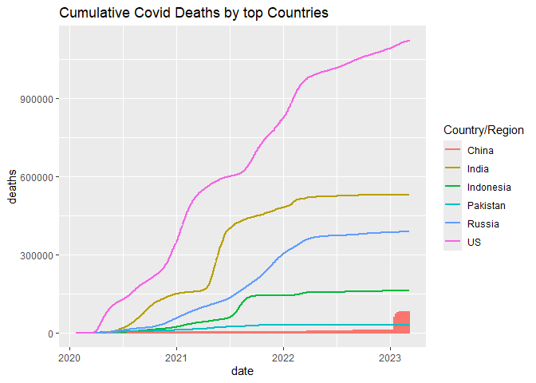

Covid Final
================
2026-06-15

## Question(s) of interest

1.  Where are cases located in the US?
2.  How does the US compare to the rest of the world by Covid deaths?
3.  How much of an impact is just population size in terms of US deaths?

## Read in data

Data from Johns Hopkins database on Covid data from 2020-2023

``` r
## Get current data in the four files
url_in <- "https://raw.githubusercontent.com/CSSEGISandData/COVID-19/master/csse_covid_19_data/csse_covid_19_time_series/"
file_names <- c("time_series_covid19_confirmed_US.csv",  "time_series_covid19_confirmed_global.csv", "time_series_covid19_deaths_US.csv",  "time_series_covid19_deaths_global.csv")
urls <- str_c(url_in,file_names)

global_deaths <- read_csv(urls[4])
```

    ## Rows: 289 Columns: 1147
    ## ── Column specification ────────────────────────────────────────────────────────
    ## Delimiter: ","
    ## chr    (2): Province/State, Country/Region
    ## dbl (1145): Lat, Long, 1/22/20, 1/23/20, 1/24/20, 1/25/20, 1/26/20, 1/27/20,...
    ## 
    ## ℹ Use `spec()` to retrieve the full column specification for this data.
    ## ℹ Specify the column types or set `show_col_types = FALSE` to quiet this message.

``` r
global_cases <- read_csv(urls[2])
```

    ## Rows: 289 Columns: 1147
    ## ── Column specification ────────────────────────────────────────────────────────
    ## Delimiter: ","
    ## chr    (2): Province/State, Country/Region
    ## dbl (1145): Lat, Long, 1/22/20, 1/23/20, 1/24/20, 1/25/20, 1/26/20, 1/27/20,...
    ## 
    ## ℹ Use `spec()` to retrieve the full column specification for this data.
    ## ℹ Specify the column types or set `show_col_types = FALSE` to quiet this message.

``` r
us_deaths <- read_csv(urls[3])
```

    ## Rows: 3342 Columns: 1155
    ## ── Column specification ────────────────────────────────────────────────────────
    ## Delimiter: ","
    ## chr    (6): iso2, iso3, Admin2, Province_State, Country_Region, Combined_Key
    ## dbl (1149): UID, code3, FIPS, Lat, Long_, Population, 1/22/20, 1/23/20, 1/24...
    ## 
    ## ℹ Use `spec()` to retrieve the full column specification for this data.
    ## ℹ Specify the column types or set `show_col_types = FALSE` to quiet this message.

``` r
us_cases <- read_csv(urls[1])
```

    ## Rows: 3342 Columns: 1154
    ## ── Column specification ────────────────────────────────────────────────────────
    ## Delimiter: ","
    ## chr    (6): iso2, iso3, Admin2, Province_State, Country_Region, Combined_Key
    ## dbl (1148): UID, code3, FIPS, Lat, Long_, 1/22/20, 1/23/20, 1/24/20, 1/25/20...
    ## 
    ## ℹ Use `spec()` to retrieve the full column specification for this data.
    ## ℹ Specify the column types or set `show_col_types = FALSE` to quiet this message.

## Tidy Data

``` r
us_deaths <- us_deaths %>%
     pivot_longer(cols = 
          -c(`Province_State`, `Country_Region`, Lat, Long_,
             UID, iso2, iso3, code3, FIPS, Admin2, Combined_Key),
            names_to = "date",
            values_to = "deaths") %>%
     select(-c(Lat, Long_))

global_cases <- global_cases %>%
     pivot_longer(cols = 
          -c(`Province/State`, `Country/Region`, Lat, Long),
            names_to = "date",
            values_to = "cases") %>%
     select(-c(Lat, Long))

us_cases <- us_cases %>%
  pivot_longer(cols = -(UID:Combined_Key),
               names_to = "date",
               values_to = "cases") %>%
  select(Admin2:cases) %>%
  select(-c(Lat, Long_))
us_cases <- us_cases %>% filter(date != "Population" & cases > -1)

global_deaths <- global_deaths %>%
  pivot_longer(cols = -(`Province/State`:Long),
               names_to = "date",
               values_to = "deaths") %>%
  select(-c(Lat, Long))

global_deaths$date <- as.Date(global_deaths$date, format = "%m/%d/%y")
```

Data cleaned to simplify one row per date per location (dependent on
table) Cleaning for tables as needed to adjust dates into correct
formats, clean out unnecessary columns, etc Tables provide a cumulative
case/death count grouped by location over time

## Visualize Data

``` r
summed_us_deaths <- us_deaths %>% rename(state = Province_State) %>% filter(date == "3/9/23") %>% group_by(state) %>% summarise(total_deaths = sum(deaths, na.rm = TRUE))
plot_usmap(data = summed_us_deaths, values = "total_deaths", color = "red") +
  scale_fill_continuous(name = "Covid Deaths") + 
  theme(legend.position = "right") +
  labs(title = "Total Covid Deaths by State")
```

<!-- -->

``` r
top_countries <- c("US", "Russia", "India", "Indonesia", "Pakistan", "China")
filtered_global <- global_deaths %>%
  filter(`Country/Region` %in% top_countries)
ggplot(filtered_global, aes(x = date, y = deaths, color = `Country/Region`, group = `Country/Region`)) + 
  geom_line(linewidth = 1) +
  scale_y_continuous(labels = function(y) format(y, scientific = FALSE)) +
  labs(title = "Cumulative Covid Deaths by top Countries")
```

<!-- --> The first
graph (the map of the US) is exactly what you’d expect to find: the
higher population states have more cases. Texas, California, New York
and Florida, the highest population states, also have the most cases
reported.

The second graph has some more interesting conclusions to draw. The US
blows the rest of the world out of the water in terms of Covid deaths. I
filtered the data here for some of the most populous countries and also
some of the countries with highest death counts, and there were some
anomalies. China is one of the top populated countries on earth (and
where Covid originated), but it has remarkably low death counts.
Interesting. Same story for Pakistan. Russia is a far less populous
country, though it has double the cases of Indonesia despite its lower
population and far lower population density. This is likely due to
differences in reporting more than anything, to be touched on in the
bias discussion.

## Model Data

``` r
pop_table <- us_deaths %>%
  filter(date %in% c("Population", "3/9/23")) %>%
  pivot_wider(names_from = date, values_from = deaths) %>%
  rename(deaths = `3/9/23`)
model <- lm(deaths ~ Population, data = pop_table)
summary(model)
```

    ## 
    ## Call:
    ## lm(formula = deaths ~ Population, data = pop_table)
    ## 
    ## Residuals:
    ##     Min      1Q  Median      3Q     Max 
    ## -4986.7   -19.6    -1.3    35.0  6128.3 
    ## 
    ## Coefficients:
    ##              Estimate Std. Error t value Pr(>|t|)    
    ## (Intercept) 1.492e+01  6.585e+00   2.265   0.0236 *  
    ## Population  3.226e-03  1.942e-05 166.122   <2e-16 ***
    ## ---
    ## Signif. codes:  0 '***' 0.001 '**' 0.01 '*' 0.05 '.' 0.1 ' ' 1
    ## 
    ## Residual standard error: 363.9 on 3340 degrees of freedom
    ## Multiple R-squared:  0.892,  Adjusted R-squared:  0.892 
    ## F-statistic: 2.76e+04 on 1 and 3340 DF,  p-value: < 2.2e-16

Here I wanted to see just how much of an impact population had on death
counts. The US data was set up to be more reliable than the world data
so I ran with it. Turns out, with an R^2 value of .89 (89% of variance
due to population) and a p value of 2e^-16, there is a ridiculously
strong correlation between the two. I was expecting it to be relatively
strong but those are astronomical numbers. Population almost solely
dictates how many cases a county would get.

## Conclusion/Bias

In conclusion, population of a country/state has a major impact on the
number of cases or deaths said region would have. That makes sense. The
more people you have, the higher potential for total cases or deaths you
have as well. That said, this is complicated by reporting bias. A
country is not necessarily incentivized to fully admit to total
death/case numbers. There is no international police force to crack down
on statistical reporting. That leads to inflated (well, deflated) case
counts and death tolls reported in countries you’d expect to see far
higher numbers from. China hovering in just the 10s of thousands of
deaths while the US had well over a million suggests something is off.
Especially considering the high correlation bewteen population and
deaths within the states (which had more regular and reliable reporting
numbers).
