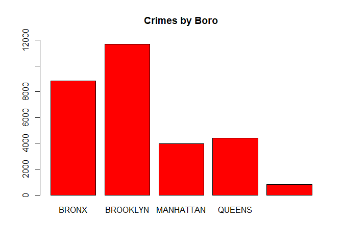
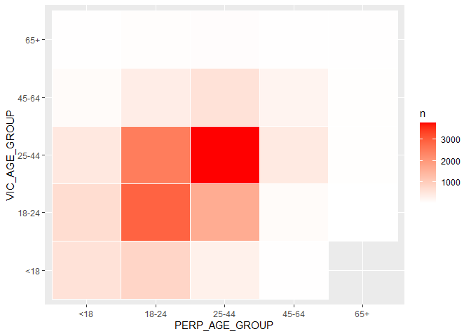

NYPD Shooting Data
================
2026-05-27

## Prepare Data

I filtered the data based on relevant columns (and a few more that I
considered using for analysis later). Given the date and time, I
concatenated them and transformed them into a date data type.

``` r
## Get current data in the NYPD File
filename <- "ARCHIVED_NYPD_Shooting_Incident_Data__Historic_.csv"
data <- read_csv(filename)
```

    ## Rows: 29744 Columns: 21
    ## ── Column specification ────────────────────────────────────────────────────────
    ## Delimiter: ","
    ## chr  (12): OCCUR_DATE, BORO, LOC_OF_OCCUR_DESC, LOC_CLASSFCTN_DESC, LOCATION...
    ## dbl   (5): INCIDENT_KEY, PRECINCT, JURISDICTION_CODE, Latitude, Longitude
    ## num   (2): X_COORD_CD, Y_COORD_CD
    ## lgl   (1): STATISTICAL_MURDER_FLAG
    ## time  (1): OCCUR_TIME
    ## 
    ## ℹ Use `spec()` to retrieve the full column specification for this data.
    ## ℹ Specify the column types or set `show_col_types = FALSE` to quiet this message.

``` r
# Select OCCUR_DATE, OCCUR_TIME, BORO, STATISTICAL_MURDER_FLAG, PERP_AGE_GROUP, VIC_AGE_GROUP
filtered_data <- data[, c("OCCUR_DATE", "OCCUR_TIME", "BORO", "STATISTICAL_MURDER_FLAG",
                          "PERP_AGE_GROUP", "VIC_AGE_GROUP")]
filtered_data <- filtered_data %>%
  mutate(DATE_TIME = mdy_hms(paste(OCCUR_DATE, OCCUR_TIME)))
filtered_data <- subset(filtered_data, select = -c(OCCUR_DATE, OCCUR_TIME))
# There are a substantial number of missing PERP_AGE_GROUP, I've chosen to work
# with what's left and accept that the data set is incomplete.
```

There is a substantial amount of missing data for PERP_AGE_GROUP, so I
chose to accept my losses and work with the data that’s there for that
analysis. There is no simple way to impute data for those categories
with so much of it missing.

## Graph Data

``` r
barplot(table(filtered_data$BORO), 
        main = "Crimes by Boro",
        col = "red",
        ylim = c(0, 12000))
```

<!-- -->

``` r
heatmap_data <- filtered_data %>% filter(PERP_AGE_GROUP != "(null)")
heatmap_data <- heatmap_data %>% filter(PERP_AGE_GROUP != "UNKNOWN")
heatmap_data <- heatmap_data %>% filter(PERP_AGE_GROUP != "NA")
heatmap_data <- heatmap_data %>% filter(PERP_AGE_GROUP != "1020")
heatmap_data <- heatmap_data %>% filter(PERP_AGE_GROUP != "1028")
heatmap_data <- heatmap_data %>% filter(PERP_AGE_GROUP != "2021")
heatmap_data <- heatmap_data %>% filter(PERP_AGE_GROUP != "224")
heatmap_data <- heatmap_data %>% filter(PERP_AGE_GROUP != "940")
heatmap_data <- heatmap_data %>% filter(VIC_AGE_GROUP != "UNKNOWN")
heatmap_data <- heatmap_data %>% filter(VIC_AGE_GROUP != "1022")

heatmap_data <- heatmap_data %>% count(PERP_AGE_GROUP, VIC_AGE_GROUP)
ggplot(heatmap_data, aes(x = PERP_AGE_GROUP, y = VIC_AGE_GROUP, fill = n)) +
         geom_tile(color = "white") +
         scale_fill_gradient(low = "white", high = "red")
```

<!-- --> In the
first graph, the crime is clearly centralized in a few Boros (Brooklyn
and the Bronx), whereas the other three Boros are substantially quieter.
There isn’t a whole lot more to glean here without population data to
determine if those boros have more crime because there are simply more
people, or if there are confounding factors at play.

The second graph - the heatmap - gives a bit more detail on the
demographics of crimes in the data base. It seems that the most crimes
are committed by people 25-44 yrs old against people in the same age
range. This is followed closely by people ages 18-24 vs 18-24, though it
should be noted that there is a substantially smaller range for that
category over the first (6 yrs vs 19). That implies the average rate of
crime is likely higher within the 18-24 yr age group vs 18-24 (and
against 25-44 as well) than the 25-44 vs 25-44 yr age group. It would be
helpful to see the exact ages to avoid this range confusion, because
this makes me question the actual rates given such a large discrepancy
in range size.

## Model Data

``` r
model <- glm(STATISTICAL_MURDER_FLAG ~ DATE_TIME, data = filtered_data)
summary(model)
```

    ## 
    ## Call:
    ## glm(formula = STATISTICAL_MURDER_FLAG ~ DATE_TIME, data = filtered_data)
    ## 
    ## Coefficients:
    ##              Estimate Std. Error t value Pr(>|t|)    
    ## (Intercept) 1.842e-01  1.837e-02  10.029   <2e-16 ***
    ## DATE_TIME   6.781e-12  1.288e-11   0.526    0.599    
    ## ---
    ## Signif. codes:  0 '***' 0.001 '**' 0.01 '*' 0.05 '.' 0.1 ' ' 1
    ## 
    ## (Dispersion parameter for gaussian family taken to be 0.1562632)
    ## 
    ##     Null deviance: 4647.6  on 29743  degrees of freedom
    ## Residual deviance: 4647.6  on 29742  degrees of freedom
    ## AIC: 29203
    ## 
    ## Number of Fisher Scoring iterations: 2

This essentially tells us there is absolutely no correlation between the
date+time of the event and it being a murder or not. This is likely
because there is little overlap of the times specifically, but the model
does not care about a time that is off by a few minutes or even on the
same day from another.

## Conclusion

Through this analysis, it can be noted that the Bronx and Brooklyn have
the highest crime rates within the data set with respect to Boros. We
can also tell that crimes between 18-24 yr olds and other 18-24 yr olds
are likely the highest rate, though it is difficult to tell without more
fine-tune data. The data set has some potential bias sources that may
influence what we can analyze from the data. Police reports tend to be
fairly factual, though a huge red flag that caught my attention was a
substantial lack of data for some of these categories. There was a lot
of missing data for perpetrators (possibly because they were not
apprehended), which may have skewed the results based on what
demographics tended to be pursued more or less for crimes reported here.
